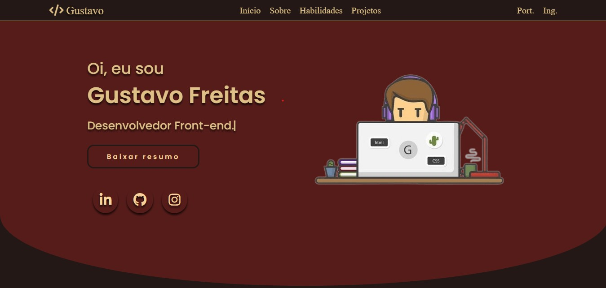

<h1 align="center"><a href="https://gustavo-freita.github.io/portifolio/#inicio">Portifólio</a></h1>

## Descrição do Projeto:

Esse portfólio foi criado com o objetivo de apresentar meus trabalhos e habilidades para visitantes que estejam interessados em conhecer mais sobre mim como desenvolvedor.

## Project Description:

This portfolio was created to present my work and skills to visitors who are interested in knowing more about me as a developer.

<h2 align="center">

</h2>

<h3 align="center">
  
</h3>

### 🛠 Tecnologias / Technologies

As seguintes ferramentas foram usadas na construção do projeto / The following tools were used in building the project:

- [HTML](https://www.w3schools.com/html/)
- [CSS](https://www.w3schools.com/Css/)
- [JavaScript](https://developer.mozilla.org/en-US/docs/web/javascript/guide/introduction)
- [SwiperAPI](https://swiperjs.com/swiper-api)
- [ScrollReveal](https://scrollrevealjs.org/guide/whats-new.html)
- [TypeitJS](https://www.typeitjs.com/)
- [ShapeDivider](https://www.shapedivider.app/)

<h2>:hammer: Créditos</h2>
Web Page feito por / Web Page made by:

<a href="https://github.com/gustavo-freita">Gustavo Freitas</a> <a href="https://github.com/gustavo-freita">
